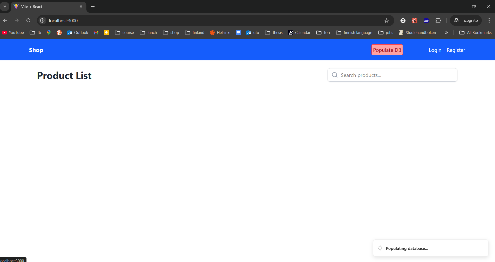
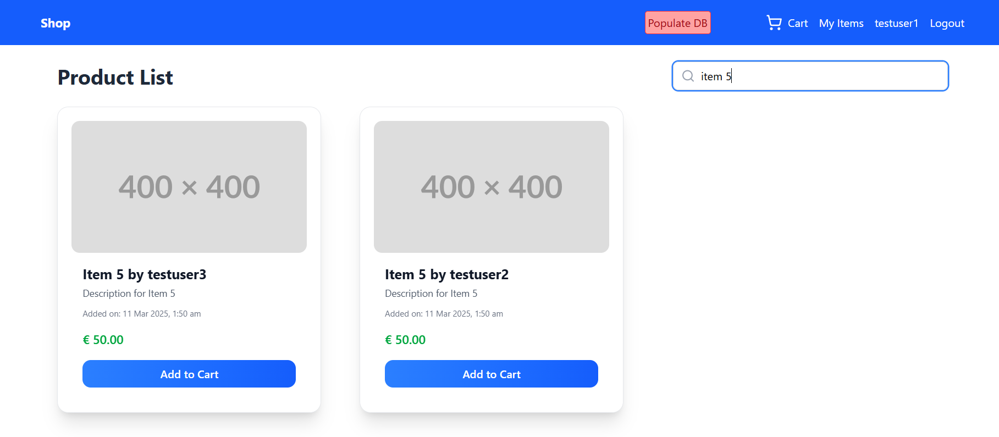
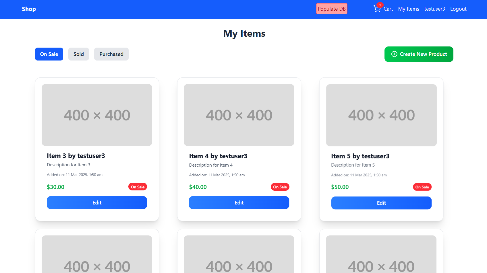
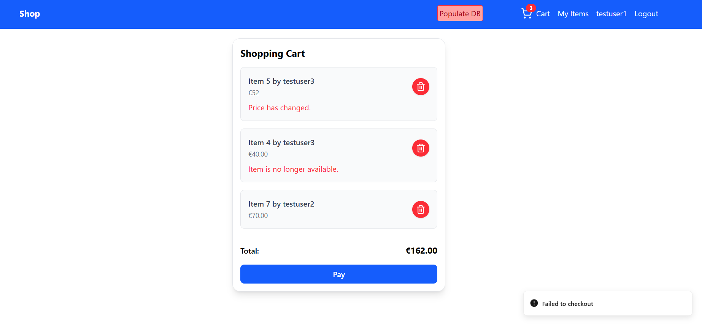
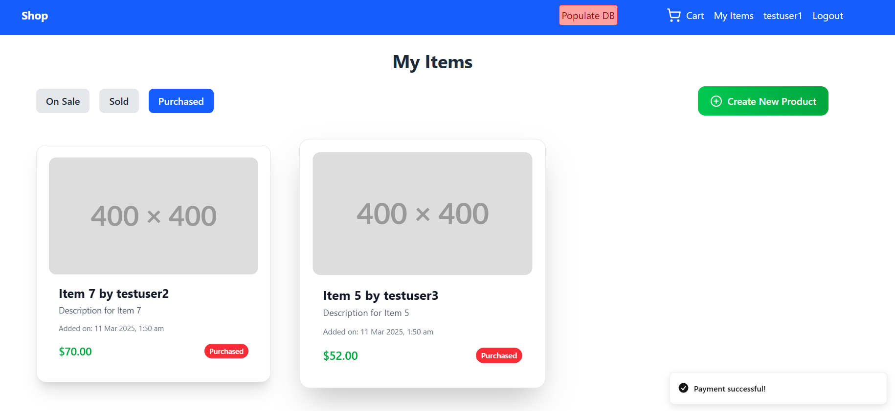

# WebShop

## Author
- **Name**: Nazmus Sakib
- **Email**: nazmus.x.sakib@abo.fi

## Implemented Requirements
All the mandatory and optional requirements have been implemented.

### Mandatory Requirements:
- Project folder
- Backend in Django rest framework
- Frontend in React
- Automatic DB population
- Browse items
- Create account
- Login
- Create new product
- Add to cart

### Optional Requirements:
- Search by title
- Remove from cart
- Pay for cart
- Routing in react
- Change password
- View my items inventory
- Edit product
- Web pages look nice and easy to use on regular desktop screens

## How to Run the Project

### Prerequisites
Make sure you have the following installed on your system:
- **Python 3.12.2**
- **Node v20.11.1**

### Step-by-Step Instructions for Windows OS

#### 1. Clone the Repository
```bash
git clone https://github.com/AA-IT-WebTechCourse/webshopproject2024-sakib7.git
cd webshopproject2024-sakib7
```
#### 2. Set up a Virtual Environment (windows cmd)
```bash
python -m venv venv
venv\Scripts\activate.bat
```
#### 3. Install Dependencies
```bash
pip install -r requirements.txt
```

#### 4. Apply Migrations
```bash
python manage.py migrate
```
#### 5. Run the backend server
```bash
 python manage.py runserver localhost:8000 
```

#### 6. Run the frontend server 

```bash
cd frontend
npm install
npm run dev
```
Note: Run the frontend on a new terminal window. You can cd into the project folder and then run.

#### 7. View in browser

- Go to `http://localhost:3000/` to see the webshop. 
- Initially no products will be there, click 'populate db' button to populate data. 
- If you run populate_db multiple times, you will have to logout to clear the local storage. Otherwise, you may get 'Invalid token' error if you were logged in before.
- Notification messages are always shown in bottom-right corner.

## Screenshots of the UI


*Click populate db button to populate. .*


*Type in the search bar to search products by title.*


*My items/Inventory page. It also has the 'Create new product' button.*


*Shopping cart page. Error notification is shown in red text in each product.*


*For successful payment, user will be redirected to the purchased tab of my items page*
## Conclusion

**Feel free to send me an email if you face any issue to run the project**